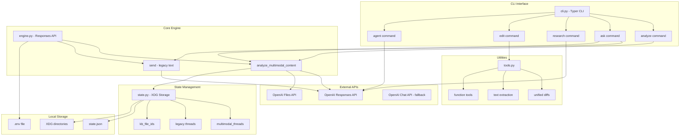
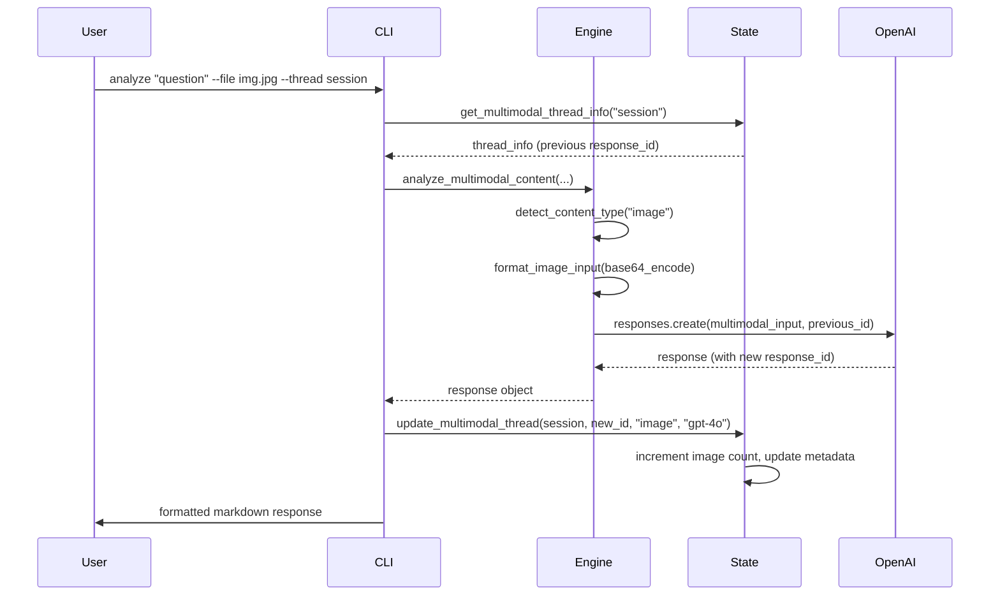

# Architecture Overview

This document provides a high-level overview of edge-assistant's system architecture, design principles, and component interactions.

## System Architecture



## Design Principles

### 1. Unified Multimodal Interface
- **Single Command**: `analyze` handles all content types (text, images, documents)
- **Content Agnostic**: Same threading system works across modalities
- **Auto-Detection**: Intelligent content type and model selection

### 2. Threading-First Architecture
- **Server-Side State**: Leverages OpenAI Responses API for context management
- **Local Metadata**: Thread tracking with content type breakdown
- **Cross-Modal Context**: Seamless conversation flow across different content types

### 3. API Consistency
- **Responses API Primary**: All new functionality built on latest OpenAI API
- **Legacy Compatibility**: Fallback support for Chat Completions API
- **Future Ready**: Architecture prepared for upcoming modalities (audio, video)

### 4. Safety-First Design
- **Dry-Run Default**: Preview changes before applying (edit command)
- **Explicit Approval**: User confirmation for destructive operations (agent mode)
- **Local-First**: Sensitive data never cached locally

### 5. Developer Experience
- **Simple CLI**: Intuitive commands with sensible defaults
- **Rich Output**: Formatted markdown responses with syntax highlighting
- **Comprehensive Help**: Built-in documentation and examples

## Component Deep Dive

### CLI Layer (`cli.py`)

#### Command Architecture
```python
# Unified multimodal analysis
@app.command("analyze")
def analyze(
    prompt: str,
    content_path: Optional[Path] = None,
    thread: Optional[str] = None,
    # ... additional options
):
    # Route to unified engine
    result = eng.analyze_multimodal_content(...)
    
# Enhanced text conversation
@app.command("ask") 
def ask(
    prompt: str,
    thread: Optional[str] = None,
    use_multimodal_engine: bool = True  # Default to new engine
):
    # Choice between unified and legacy engines
```

#### Design Patterns
- **Option Consolidation**: Common options (--thread, --system, --model) across commands
- **Backward Compatibility**: Legacy commands maintained with deprecation notices
- **Progressive Enhancement**: New features opt-in, existing workflows unaffected

### Engine Layer (`engine.py`)

#### Unified Content Processing
```python
def analyze_multimodal_content(
    content_path: str = None,
    user_prompt: str = "",
    content_type: str = "auto",
    previous_response_id: Optional[str] = None
):
    # 1. Content type detection
    if content_type == "auto":
        content_type = self._detect_content_type(content_path)
    
    # 2. Input formatting based on type
    if content_type == "image":
        input_content = format_image_input(content_path, user_prompt)
    elif content_type == "file":
        input_content = format_file_input(content_path, user_prompt)
    else:
        input_content = user_prompt
    
    # 3. Model selection
    model = select_optimal_model(content_type)
    
    # 4. API call with threading
    return self._get_client().responses.create(
        model=model,
        input=input_content, 
        previous_response_id=previous_response_id
    )
```

#### Content Type Handling
| Content Type | Processing | Model | API Format |
|--------------|------------|-------|------------|
| text | Direct input | gpt-4o-mini | String |
| image | Base64 encode | gpt-4o | Multimodal array |
| file | Upload to OpenAI | gpt-4o | Attachment |
| audio | Future: Base64 | gpt-4o | Multimodal array |
| video | Future: Base64 | gpt-4o | Multimodal array |

### State Management (`state.py`)

#### Thread State Model
```python
# Multimodal thread structure
{
    "content_counts": {"text": 5, "image": 2, "file": 1},
    "last_activity": 1703123456,
    "response_id": "resp_abc123",
    "model_used": "gpt-4o", 
    "total_interactions": 8
}
```

#### Operation Patterns
- **Lazy Loading**: State loaded on first access
- **Atomic Updates**: Temp file + rename for consistency  
- **Auto-Cleanup**: Background removal of old threads
- **Migration Support**: Automatic upgrade of legacy formats

### Utility Layer (`tools.py`)

#### Core Functions
- **Diff Generation**: Unified diff format for file changes
- **Text Extraction**: URL and content parsing utilities
- **Function Tools**: OpenAI function calling definitions

## Data Flow Patterns

### Multimodal Analysis Flow


### Threading Context Flow
```mermaid
graph LR
    subgraph "Thread Session"
        T1[Text: "What is AI?"]
        T2[Image: "Analyze chart.jpg"] 
        T3[File: "Review report.pdf"]
        T4[Text: "Synthesize findings"]
    end
    
    T1 -->|resp_id_1| T2
    T2 -->|resp_id_2| T3  
    T3 -->|resp_id_3| T4
    
    subgraph "State Updates"
        S1[text: 1, total: 1]
        S2[text: 1, image: 1, total: 2]
        S3[text: 1, image: 1, file: 1, total: 3]
        S4[text: 2, image: 1, file: 1, total: 4]
    end
    
    T1 -.-> S1
    T2 -.-> S2
    T3 -.-> S3
    T4 -.-> S4
```

## Performance Characteristics

### Latency Profile
- **Text Analysis**: 200ms - 2s (depends on complexity)
- **Image Analysis**: 1s - 5s (includes encoding + vision processing)
- **File Analysis**: 2s - 10s (includes upload + document processing)
- **Thread Lookup**: < 1ms (local JSON operations)

### Scalability Factors
- **Thread Count**: Optimal < 100 active threads
- **State File Size**: Linear growth with thread count
- **Memory Usage**: ~10MB baseline + loaded state
- **Concurrent Users**: Single-user design (no concurrency support)

## Security Architecture

### API Key Management
```python
# Priority order for API key resolution
1. OPENAI_API_KEY environment variable
2. .env file in current directory  
3. .env file in parent directories (up to git root)
4. Error if not found
```

### Data Protection
- **No Local Caching**: Content never stored locally
- **Metadata Only**: Only interaction metadata persisted
- **File Permissions**: State files protected (600 permissions)
- **No Network Storage**: All data local or OpenAI-managed

## Error Handling Strategy

### Layered Error Handling
```python
# 1. API Level - Engine Layer
try:
    response = client.responses.create(...)
except OpenAIError as e:
    # Log error, attempt fallback or user-friendly message

# 2. Command Level - CLI Layer  
try:
    result = eng.analyze_multimodal_content(...)
except FileNotFoundError:
    console.print("[red]File not found[/red]")
except Exception as e:
    console.print(f"[red]Unexpected error: {e}[/red]")

# 3. State Level - Storage Layer
try:
    state = _load()
except json.JSONDecodeError:
    # Reset to empty state with warning
```

### Recovery Strategies
- **Graceful Degradation**: Fallback to legacy APIs when possible
- **State Recovery**: Auto-repair corrupted state files
- **User Communication**: Clear error messages with suggested actions

## Extension Points

### Adding New Content Types
```python
# 1. Update content type detection
def _detect_content_type(self, file_path: str) -> str:
    if extension in ['.mp3', '.wav']:
        return "audio"  # New type
    
# 2. Add content processing
elif content_type == "audio":
    input_content = format_audio_input(content_path, user_prompt)
    
# 3. Update state tracking
"content_counts": {"text": 0, "image": 0, "audio": 0, ...}
```

### Adding New Commands
```python
# 1. Create command in cli.py
@app.command("new-feature")
def new_feature(...):
    # Implementation
    
# 2. Add engine support if needed
def engine_method(self, ...):
    # Engine logic
    
# 3. Update documentation
# - README.md examples
# - Command help strings
```

## Future Architecture Evolution

### Planned Enhancements
1. **Configuration System**: User preferences and defaults
2. **Plugin Architecture**: Extensible tool system
3. **Caching Layer**: Response caching for offline access
4. **Multi-User Support**: Shared knowledge bases and threads
5. **Real-Time Features**: Streaming responses and live updates

### Technology Roadmap
- **Audio/Video Support**: When available in Responses API
- **Local LLM Integration**: Fallback for privacy-sensitive use cases  
- **Database Backend**: Migration to SQLite for larger deployments
- **Web Interface**: Browser-based UI for enhanced UX