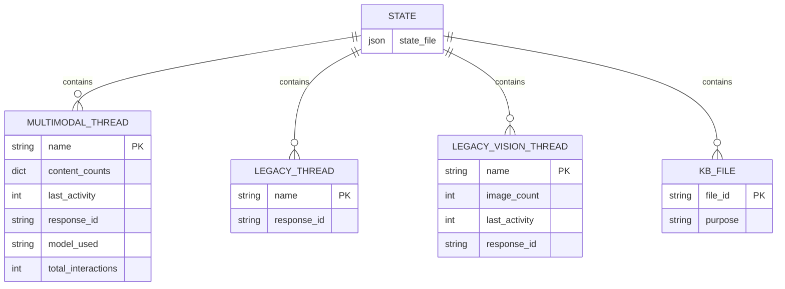

# Database Specification

This document outlines the data models, relationships, and database interactions used by edge-assistant.

## Database Architecture

### Storage Model: File-Based JSON

edge-assistant uses a **file-based JSON storage model** rather than traditional databases for simplicity and portability.

**Rationale:**
- **Simplicity**: No database dependencies or setup required
- **Portability**: Single JSON file easily backed up and transferred
- **Performance**: Sufficient for personal/small team usage patterns
- **Local-First**: All data stored locally, no remote database dependencies

## Data Models

### Primary Entities

#### 1. Multimodal Thread
```python
class MultimodalThread:
    name: str                          # Thread identifier
    content_counts: Dict[str, int]     # Count by content type
    last_activity: int                 # Unix timestamp
    response_id: str                   # OpenAI response ID for threading
    model_used: str                    # Last model used
    total_interactions: int            # Total interaction count
```

#### 2. Legacy Text Thread
```python
class LegacyThread:
    name: str           # Thread identifier  
    response_id: str    # OpenAI response ID
```

#### 3. Legacy Vision Thread  
```python
class LegacyVisionThread:
    name: str           # Thread identifier
    image_count: int    # Number of images processed
    last_activity: int  # Unix timestamp
    response_id: str    # OpenAI response ID
```

#### 4. Knowledge Base File
```python
class KnowledgeBaseFile:
    file_id: str        # OpenAI file ID
    purpose: str        # Always "file_search"
    # Note: Metadata like filename not stored locally
```

## Data Relationships

### Entity Relationship Model



### Data Flow

#### Thread Creation Flow
```python
# 1. User initiates threaded conversation
user_input = "analyze this image" 
thread_name = "my-session"

# 2. Check existing thread state
thread_info = get_multimodal_thread_info(thread_name)
previous_id = thread_info.get("response_id")

# 3. Call OpenAI with context
response = client.responses.create(
    input=user_input,
    previous_response_id=previous_id
)

# 4. Update thread state
update_multimodal_thread(
    name=thread_name,
    response_id=response.id,
    content_type="image", 
    model="gpt-4o"
)
```

## Query Patterns

### Read Operations

#### Get Thread Information
```python
def get_multimodal_thread_info(name: str) -> Dict[str, Any]:
    """
    Query: Find thread by name
    Complexity: O(1) - Direct dictionary lookup
    """
    state = _load()
    threads = state.get("multimodal_threads", {})
    return threads.get(name, default_thread_info())
```

#### List All Threads
```python
def list_all_threads() -> Dict[str, Any]:
    """
    Query: Get all threads with metadata
    Complexity: O(1) - Return entire dictionary
    """
    state = _load()
    return {
        "multimodal": state.get("multimodal_threads", {}),
        "legacy": state.get("threads", {}),
        "vision": state.get("vision_threads", {})
    }
```

#### Search Threads by Content Type
```python
def find_threads_by_content_type(content_type: str) -> List[str]:
    """
    Query: Find threads containing specific content type
    Complexity: O(n) - Linear scan through threads
    """
    state = _load()
    threads = state.get("multimodal_threads", {})
    
    result = []
    for name, info in threads.items():
        if info.get("content_counts", {}).get(content_type, 0) > 0:
            result.append(name)
    return result
```

### Write Operations

#### Create/Update Thread
```python
def update_multimodal_thread(name: str, response_id: str, content_type: str, model: str):
    """
    Operation: Upsert thread information
    Atomicity: Full file rewrite ensures consistency
    """
    state = _load()
    state.setdefault("multimodal_threads", {})
    
    # Get or create thread info
    thread_info = state["multimodal_threads"].get(name, {
        "content_counts": {"text": 0, "image": 0, "audio": 0, "video": 0, "file": 0},
        "last_activity": 0,
        "total_interactions": 0
    })
    
    # Update thread
    thread_info["content_counts"][content_type] += 1
    thread_info["last_activity"] = int(time.time())
    thread_info["response_id"] = response_id
    thread_info["model_used"] = model
    thread_info["total_interactions"] += 1
    
    state["multimodal_threads"][name] = thread_info
    _save(state)
```

#### Delete Thread
```python
def clear_multimodal_thread(name: str) -> bool:
    """
    Operation: Delete thread by name
    Returns: Success status
    """
    state = _load()
    threads = state.get("multimodal_threads", {})
    
    if name in threads:
        del threads[name]
        state["multimodal_threads"] = threads
        _save(state)
        return True
    return False
```

## Data Integrity

### Consistency Rules

#### Thread Consistency
```python
def validate_thread_consistency(thread_info: Dict) -> bool:
    """Ensure thread data is internally consistent"""
    content_counts = thread_info.get("content_counts", {})
    total_interactions = thread_info.get("total_interactions", 0)
    
    # Total interactions should match sum of content counts
    calculated_total = sum(content_counts.values())
    return calculated_total == total_interactions
```

#### File ID Uniqueness
```python
def ensure_unique_file_ids(state: Dict) -> Dict:
    """Ensure no duplicate file IDs in knowledge base"""
    file_ids = state.get("kb_file_ids", [])
    state["kb_file_ids"] = list(set(file_ids))  # Remove duplicates
    return state
```

### Data Validation

#### Schema Validation
```python
def validate_state_schema(state: Dict) -> List[str]:
    """Validate state file against expected schema"""
    errors = []
    
    # Check required top-level keys
    required_keys = ["conversation_threads", "kb_file_ids", "multimodal_threads"]
    for key in required_keys:
        if key not in state:
            errors.append(f"Missing required key: {key}")
    
    # Validate thread structures
    for name, thread in state.get("multimodal_threads", {}).items():
        if "content_counts" not in thread:
            errors.append(f"Thread {name} missing content_counts")
    
    return errors
```

## Performance Characteristics

### Read Performance
- **Single thread lookup**: O(1)
- **All threads scan**: O(1) 
- **Content type search**: O(n) where n = number of threads
- **File size impact**: Minimal for typical usage (< 100KB)

### Write Performance  
- **Single thread update**: O(1) for update + O(k) for file write where k = state size
- **Bulk operations**: Same as single due to full file rewrite
- **Atomic operations**: Ensured by temp file + rename

### Scalability Limits
- **Thread count**: Practical limit ~1000 threads before performance degradation
- **File size**: JSON parsing becomes noticeable > 10MB
- **Concurrent access**: Not supported (single-user design)

## Optimization Strategies

### Current Optimizations
```python
# Lazy loading of state
_state_cache = None

def _load():
    global _state_cache
    if _state_cache is None:
        _state_cache = load_from_disk()
    return _state_cache

# Atomic writes via temp file
def _save(state):
    temp_file = f"{state_file}.tmp" 
    with open(temp_file, 'w') as f:
        json.dump(state, f)
    os.rename(temp_file, state_file)  # Atomic on Unix systems
```

### Future Optimizations
```python
# Incremental updates (planned)
def incremental_thread_update(name: str, updates: Dict):
    """Update only specific fields without full reload"""
    
# Write-through cache (planned)  
def cached_state_operation(operation):
    """Cache state in memory with write-through to disk"""
    
# Compressed storage (planned)
def compressed_state_save(state: Dict):
    """Use gzip compression for large state files"""
```

## Migration & Versioning

### Schema Versioning
```python
CURRENT_SCHEMA_VERSION = "1.0"

def migrate_state_schema(state: Dict, from_version: str) -> Dict:
    """Migrate state from older schema versions"""
    if from_version < "1.0":
        state = migrate_legacy_vision_threads(state)
    return state
```

### Legacy Data Migration
```python
def migrate_legacy_vision_threads(state: Dict) -> Dict:
    """Convert vision_threads to multimodal_threads format"""
    legacy_vision = state.get("vision_threads", {})
    multimodal = state.setdefault("multimodal_threads", {})
    
    for name, vision_info in legacy_vision.items():
        if name not in multimodal:
            multimodal[name] = {
                "content_counts": {
                    "text": 0, 
                    "image": vision_info.get("image_count", 0),
                    "audio": 0, "video": 0, "file": 0
                },
                "last_activity": vision_info.get("last_activity", 0),
                "response_id": vision_info.get("response_id"),
                "model_used": "gpt-4o",
                "total_interactions": vision_info.get("image_count", 0)
            }
    
    return state
```

## Backup & Recovery

### Backup Strategies
```python
def create_state_backup(backup_dir: str):
    """Create timestamped backup of state file"""
    timestamp = datetime.now().strftime("%Y%m%d_%H%M%S")
    backup_file = f"{backup_dir}/state_backup_{timestamp}.json"
    shutil.copy2(state_file, backup_file)
```

### Recovery Procedures
```python
def recover_from_corruption():
    """Recover from corrupted state file"""
    # 1. Try to load state
    try:
        state = _load()
    except json.JSONDecodeError:
        # 2. Look for recent backup
        backup = find_latest_backup()
        if backup:
            shutil.copy2(backup, state_file)
            return _load()
        # 3. Reset to empty state
        return initialize_empty_state()
```